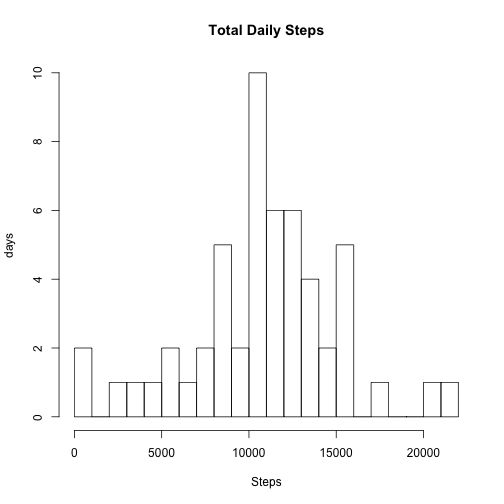
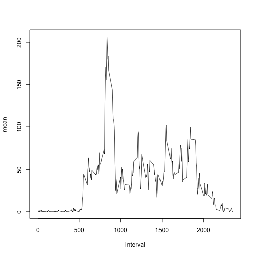
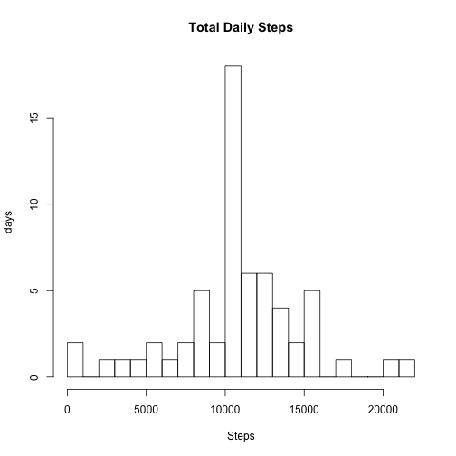
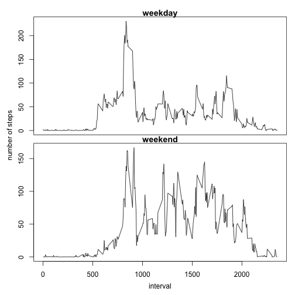

### Loading and preprocessing the data
The data to be analysed is contained in the `activity.csv` file, in standard CSV format, with a header line and missing values coded as NA. We read the CSV file into a table, converting the three columns into their relevant types in the process.

```r
activity = read.csv('activity.csv', header=TRUE, colClasses=c("integer","Date","integer"))
```

We're left with a data set containing  rows and we check the first few.

```r
dim(activity)
```

```
## [1] 17568     3
```

```r
head(activity)
```

```
##   steps       date interval
## 1    NA 2012-10-01        0
## 2    NA 2012-10-01        5
## 3    NA 2012-10-01       10
## 4    NA 2012-10-01       15
## 5    NA 2012-10-01       20
## 6    NA 2012-10-01       25
```


### What is mean total number of steps taken per day?
In order to calculate the mean total number of steps per day, we first get rid of NA values to produce a cleaned data set. We then split the data on the day's date and sum the steps to produce the total steps per day. We can then calculate the mean and median of those values.


```r
cleanedActivity <- activity[complete.cases(activity),]
splitByDay <- split(cleanedActivity, cleanedActivity$date)
dayTotals <- sapply(splitByDay, function(x) { colSums(x[1])})
hist(dayTotals, breaks=25, main="Total Daily Steps", xlab="Steps", ylab="days")
```

 

The _mean total number of steps per day_ is 10766.19.

The _median total number of steps per day_ is 10765.00.


### What is the average daily activity pattern?
To calculate the average daily activity pattern, we split the cleaned data set on the interval, then we calculate the mean number of steps for each of those five minute intervals and graph the results.

```r
splitByInterval <- split(cleanedActivity, cleanedActivity$interval)
intervalMeans <- sapply(splitByInterval, function(x) { colMeans(x[1])})
intervalMeans <- data.frame(unique(activity$interval), intervalMeans)
colnames(intervalMeans) <- c("interval", "mean")
plot(intervalMeans, type="l")
```

 

To find the interval with the greatest average number of steps, we sort the interval means in decreasing order.

```r
mostActiveInterval <- intervalMeans[order(intervalMeans$mean, decreasing=TRUE),][1,]
```

The interval with the highest number of steps is interval  with an average of 206.1698113 steps.


### Imputing missing values
In the raw activity data set, there are quite a few rows of missing data.

```r
sum(is.na(activity$steps))
```

```
## [1] 2304
```
2304 entries have missing data. We would like to replace the NA values with appropriate data. We would like to replace the missing values with either the mean value for the day, or the mean for the interval.

We'll first check to see if there are any days with zero valid entries...

```r
splitByDay <- split(activity, activity$date)
entriesPerDay <- sapply(splitByDay, function(x) { sum(!is.na(x[1]))})
length(entriesPerDay[entriesPerDay<1])
```

```
## [1] 8
```
we find that there are 8 days for which there are no entries at all, so there are some days for which we cannot calculate a mean.

We repeat the process for intervals...

```r
splitByInterval <- split(activity, activity$interval)
entriesPerInterval <- sapply(splitByInterval, function(x) { sum(!is.na(x[1]))})
length(entriesPerInterval[entriesPerInterval<1])
```

```
## [1] 0
```
This shows us that there are 0 intervals for which there are no entries at all, so this would be a better source of data to replace the `NA` values in the main data set.

We then proceed to replace the missing data in the existing activity data set with the mean value for the appropriate interval, obtained from the `intervalMeans` data set we've previously calculated.

```r
activity$steps = ifelse(is.na(activity$steps),
                        intervalMeans[match(intervalMeans$interval,activity$interval),c("mean")],
                        activity$steps)
head(activity)
```

```
##       steps       date interval
## 1 1.7169811 2012-10-01        0
## 2 0.3396226 2012-10-01        5
## 3 0.1320755 2012-10-01       10
## 4 0.1509434 2012-10-01       15
## 5 0.0754717 2012-10-01       20
## 6 2.0943396 2012-10-01       25
```

Now that we've got rid of our missing values, let's calculate the daily totals.

```r
splitByDay <- split(activity, activity$date)
completeDdayTotals <- sapply(splitByDay, function(x) { colSums(x[1])})
hist(completeDdayTotals, breaks=25, main="Total Daily Steps", xlab="Steps", ylab="days")
```

 

The _mean total number of steps per day_ is 10766.19.

The _median total number of steps per day_ is 10766.19.

Compared to our earlier calculations when we stripped the `NA` values from the data set, we can see that while the *mean* number of steps per day has not changed, the *median* has increased to match the mean.


### Are there differences in activity patterns between weekdays and weekends?
In order to visualize any differences in behaviour between the weekdays and the weekends, we first split our activity data into two separate sets.


```r
activity$day <- factor(weekdays(activity$date))
weekdayActivity <- activity[activity$day %in% c("Monday","Tuesday","Wednesday","Thursday","Friday"),]
weekendActivity <- activity[activity$day %in% c("Saturday","Sunday"),]
```

Next, we calculate the mean steps per interval for each of the sets.

```r
weekdayByInterval <- split(weekdayActivity, weekdayActivity$interval)
weekdayIntervalMeans <- sapply(weekdayByInterval, function(x) { colMeans(x[1])})
weekdayIntervalMeans <- data.frame(unique(weekdayActivity$interval), weekdayIntervalMeans)
colnames(weekdayIntervalMeans) <- c("interval", "mean")

weekendByInterval <- split(weekendActivity, weekendActivity$interval)
weekendIntervalMeans <- sapply(weekendByInterval, function(x) { colMeans(x[1])})
weekendIntervalMeans <- data.frame(unique(weekendActivity$interval), weekendIntervalMeans)
colnames(weekendIntervalMeans) <- c("interval", "mean")
```

Finally, we plot the results...

```r
par(mfrow=c(2,1), mar=c(0,0,1,0), oma=c(4,4,1,1))
plot(weekdayIntervalMeans, type="l", main="weekday", xaxt="n")
plot(weekendIntervalMeans, type="l", main="weekend")
mtext("interval", side=1, outer=TRUE, padj=4)
mtext("number of steps", side=2, outer=TRUE, padj=-4)
```

 

The difference in activity patterns is clear, with weekday activity strongly concentrated in the morning, with a smaller peak in the evening, most likely as a result of constraints imposed by people's work obligations. Conversely, at the weekend, although there is still a preference for exercsining in the mornings, significant activity still occurs during the afternoon.
